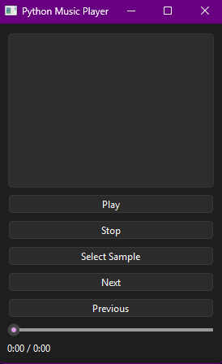

# Python Music Player

A desktop music player built with Python and PySide6.

## Features
- WAV playback
- Playlist system
- Playback position tracking

## How to run
pip install -r requirements.txt
python main.py

"If pyaudio fails to install on Windows, try pip install pipwin then pipwin install pyaudio"

## Screenshot
